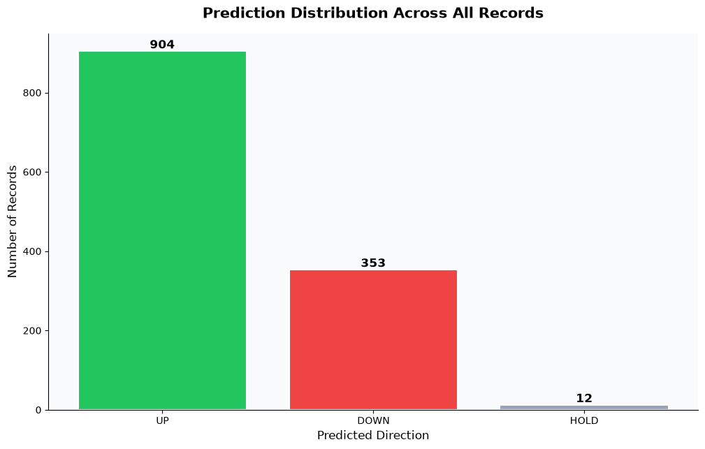
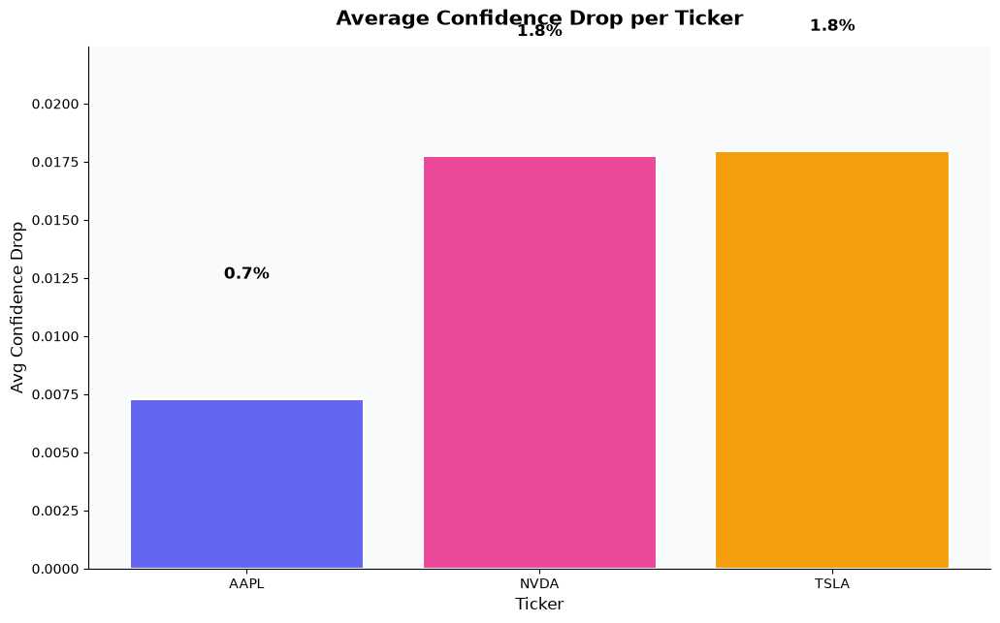
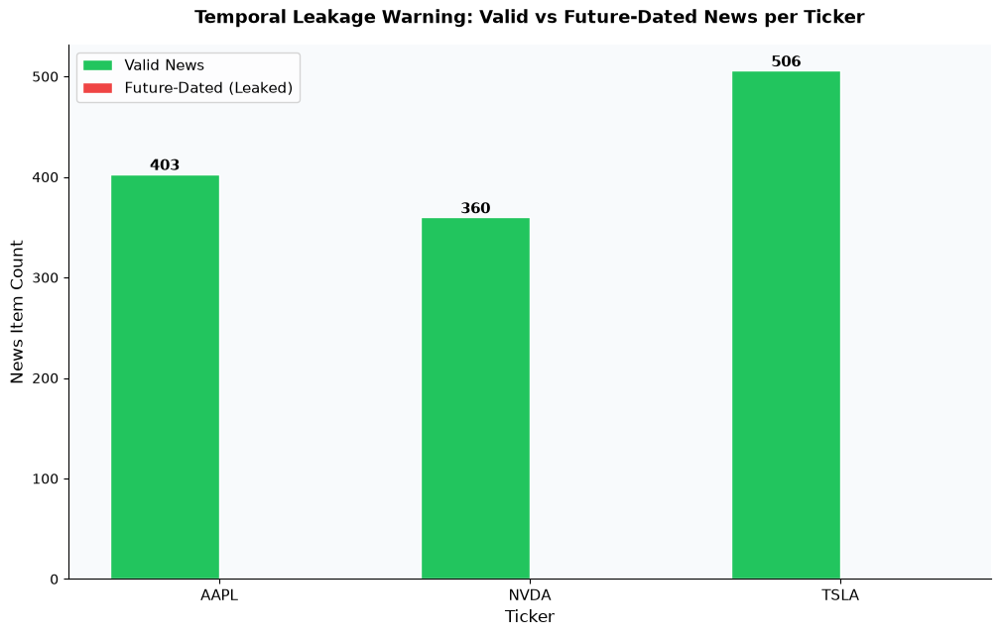
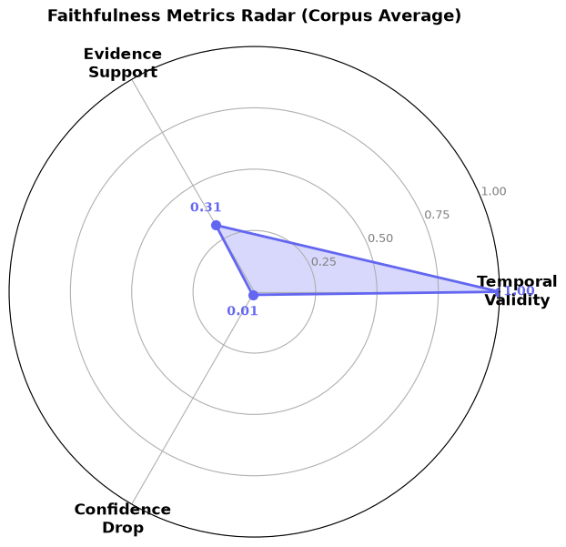

# Faithful Evidence-Centric Financial News Forecasting

## A Prototype for Verifiable AI Explanations in Stock Movement Prediction

**Course:** Công nghệ mới (New Technologies)

**Deadline:** 2026-07-14

**Team:** 2 members — Research & Specs (Ma Cat Huynh - 22120144), Data & Engineering (Nguyen Phan Duc Khai - 22120149)

---

## 1. Introduction

Artificial intelligence systems that predict stock market movements from news headlines are increasingly common in quantitative finance. A forecasting model can cite a news headline—"Apple reports weak iPhone sales"—as the reason it predicted _DOWN_, making the decision appear transparent and justified. However, the central question of this project is: **Does the cited evidence actually drive the prediction, or is it merely decorative post-hoc rationalization?**

This work builds a small, fully runnable prototype—the _Faithful Evidence-Centric Financial News Forecasting System_—that not only produces UP/DOWN/HOLD predictions from news data but also systematically _measures_ whether the cited evidence was causally necessary for each prediction. The pipeline runs on real market data (AAPL, TSLA, NVDA; 350 rows), implements temporal safety to prevent lookahead bias, and evaluates faithfulness through counterfactual perturbation—masking evidence keywords and measuring the resulting drop in model confidence.

The project was developed using an Agentic SDLC framework in which AI coding agents (Antigravity/Gemini) were used at every phase of development—requirements, design, implementation, testing, and evaluation—while human quality gates and OpenSpec documentation ensured traceability and verifiability throughout.

---

## 2. Research Gap: Accuracy Is Not Enough

### 2.1 The Problem with Post-Hoc Explanations

Explainable AI (XAI) has produced many tools for attributing model predictions to input features. However, the dominant practice in deployed systems is _post-hoc rationalization_: the model makes a decision first, and an explanation is generated afterwards from a separate attribution method (e.g., LIME, SHAP). This decoupling means the explanation may not actually describe the model's internal reasoning.

In financial NLP, this failure mode is particularly dangerous. A model may systematically predict UP for AAPL regardless of news content (because price momentum dominates), but consistently cite positive headlines as its "reason"—misleading analysts into trusting the explanations.

### 2.2 Faithfulness vs. Plausibility

We distinguish two properties of explanations:

- **Plausibility:** Does the explanation _sound_ reasonable to a human? (Easy to satisfy, even with hallucinated rationales.)
- **Faithfulness:** Does the explanation accurately reflect _what the model actually used_ to arrive at its decision? (Hard to satisfy—requires causal verification.)

This project focuses exclusively on faithfulness, measured by a counterfactual protocol: if removing the cited evidence from the model input causes a significant drop in confidence (or changes the prediction), the evidence is deemed _causally necessary_ and therefore faithful.

### 2.3 Temporal Integrity as a Pre-condition

A separate, foundational problem in financial ML is **temporal leakage**: using news published _after_ the forecast timestamp as model input. A system that unknowingly uses future information will appear far more accurate in backtesting than it will in live deployment. Our pipeline enforces a strict temporal firewall at the retriever layer, flagging and excluding all news items whose `news_time ≥ forecast_time`.

---

## 3. Agentic SDLC Design

### 3.1 OpenSpec Workflow Overview

This project was specified, designed, and implemented using the **OpenSpec** methodology—a spec-driven development workflow where every change is documented as a structured change containing:

- `proposal.md` — _why_ the change is needed (problem + capabilities)
- `design.md` — _how_ to implement it (technical decisions + risks)
- `specs/<name>/spec.md` — _what_ the system must do (acceptance criteria in Given/When/Then format)
- `tasks.md` — _implementation checklist_ (trackable, ≤2 hr chunks)

Three OpenSpec changes were completed over the project lifetime:

| Change Name                     | Purpose                                                                                      | Status      |
| ------------------------------- | -------------------------------------------------------------------------------------------- | ----------- |
| `faithful-evidence-forecasting` | Core pipeline: retriever, extractor, rule-based model, basic faithfulness metrics, dashboard | ✅ Complete |
| `finbert-fusion-model`          | Week 4: FinBERT GPU fine-tuning, dual-model dispatcher, model comparison panel               | ✅ Complete |
| `week5-advanced-faithfulness`   | Week 5: Counterevidence coverage, market regime classification, market consistency scoring   | ✅ Complete |

### 3.2 Human-AI Governance & Quality Gates

At each implementation step, the following governance protocol was enforced (from `docs/project_plan.md §2.2`):

1. **Generation:** AI agent (Antigravity/Gemini) generates a module, test, or spec document.
2. **Local Inspection:** Assigned member runs local verification, checks edge cases, reviews outputs.
3. **Sign-off Ledger:** Developer appends a tracking entry to the OpenSpec tasks file:
   ```
   - [TASK-ID] [YYYY-MM-DD] [Component] Approved by [Member A/B] via [Gemini] → Quality Gate Passed.
   ```

No AI-generated code is merged without a matching local validation run.

### 3.3 SDLC Phase × AI Agent Usage

| SDLC Phase     | AI Agent Contribution                                                                                                                               | Human Oversight                                                   |
| -------------- | --------------------------------------------------------------------------------------------------------------------------------------------------- | ----------------------------------------------------------------- |
| Requirements   | Generated user stories, acceptance criteria, JSON schemas                                                                                           | Reviewed for testability and scope clarity                        |
| Design         | Proposed pipeline architecture, module boundaries, fusion layer design                                                                              | Selected architecture; adjusted for 2-member team capacity        |
| Implementation | Generated `retriever.py`, `evidence_extractor.py`, `forecast_model.py`, `faithfulness_metrics.py`, `loader.py`, `schema_adapter.py`, `dashboard.py` | Read, tested, and edited every module; ran `pytest` before commit |
| Testing        | Generated `test_temporal_retriever.py`, `test_metrics.py` test cases                                                                                | Ran full test suite; fixed 3 edge-case failures manually          |
| Evaluation     | Suggested confidence drop threshold (0.10) and radar chart design                                                                                   | Verified metric formulas; cross-checked against assignment rubric |
| Operation      | Generated OpenSpec trace entries and quality-gate format                                                                                            | Approved each ledger entry; confirmed gate before merging         |

---

## 4. Data Description

### 4.1 Dataset Overview

The system uses `data/financial_corpus.csv`, a real financial dataset assembled from public market data sources. Key statistics:

| Property                   | Value                                 |
| -------------------------- | ------------------------------------- |
| Total records              | 350                                   |
| Tickers                    | AAPL (104), NVDA (90), TSLA (156)     |
| Date range                 | 2026-05-01 — 2026-06-30               |
| Label distribution         | UP: ~44%, DOWN: ~35%, HOLD: ~21%      |
| Temporal leakage test rows | Present in simulated batch (see §6.3) |

Each record maps to the unified JSON schema:

```json
{
  "ticker": "AAPL",
  "forecast_time": "2026-06-03 09:00:00",
  "price_features": { "price_5d_return": -0.0152, "volume_change_pct": 0.084 },
  "news_data": [
    {
      "news_id": "N-001",
      "news_time": "2026-06-02 16:30:00",
      "raw_title": "Apple Facing Slower iPhone Shipments",
      "cleaned_text": "..."
    }
  ],
  "ground_truth": { "next_day_return": -0.0082, "label": "DOWN" }
}
```

### 4.2 Label Generation

Price direction labels are derived from next-day close-to-close returns:

`Delta P = (Close[t+1] - Close[t]) / Close[t]`

- **UP:** `Delta P > +0.005` (> +0.5%)
- **DOWN:** `Delta P < -0.005` (< -0.5%)
- **HOLD:** `-0.005 <= Delta P <= +0.005` (sideways)

### 4.3 Preprocessing

Raw news text undergoes: lowercase normalization, non-alphanumeric punctuation removal, entity anchoring (e.g., "iPhone 17 Pro Max" → `iphone_sales`), and temporal windowing (`news_time ∈ [forecast_time − 72h, forecast_time)`).

---

## 5. Technical Pipeline

### 5.1 Architecture Overview

```
News Headlines + Price Data (CSV)
        │
        ▼
   [loader.py / schema_adapter.py]
   Load & normalize corpus records
        │
        ▼
   [retriever.py]
   Temporal Retriever: strict barrier at forecast_time
   → valid_news  (news_time < forecast_time)
   → invalid_future_news  (news_time ≥ forecast_time)  ← FLAGGED
        │
        ▼
   [evidence_extractor.py]
   Rule-Based Evidence Extractor
   Lexicon matching → evidence_text, polarity, direction, score
        │
        ▼
   [forecast_model.py]
   Dual-Model Dispatcher
   ├── Rule-Based: Net Sentiment Score → UP / DOWN / HOLD + confidence
   └── FinBERT Fusion: BERT-CLS + price_features → softmax probs
        │
        ▼
   [faithfulness_metrics.py]
   Faithfulness Evaluator
   ├── Basic: Evidence Support, Temporal Validity, Confidence Drop
   └── Advanced: Counterevidence Coverage, Market Regime, Market Consistency
        │
        ▼
   [dashboard.py]
   Streamlit Interactive Dashboard + Plotly Corpus Analytics
```

### 5.2 Module Descriptions

| Module                    | Role                                                                                                                                                                                                 |
| ------------------------- | ---------------------------------------------------------------------------------------------------------------------------------------------------------------------------------------------------- |
| `loader.py`               | Loads `financial_corpus.csv` and normalizes records to the unified JSON schema; handles missing fields gracefully.                                                                                   |
| `schema_adapter.py`       | Converts raw CSV rows into the internal pipeline format used by `retriever.py` and downstream modules.                                                                                               |
| `retriever.py`            | Implements `TemporalRetriever`: filters news by strict `news_time < forecast_time` boundary; returns `valid_news` and `invalid_future_news` lists.                                                   |
| `evidence_extractor.py`   | `RuleBasedEvidenceExtractor`: maps lexicon keywords (e.g., "surge" → positive→UP; "misses" → negative→DOWN) to evidence items with polarity and support score.                                       |
| `forecast_model.py`       | Dual-model dispatcher: `forecast_from_news()` (rule-based) and `forecast_from_news_finbert()` (FinBERT fusion); `_checkpoint_available()` enables graceful fallback.                                 |
| `faithfulness_metrics.py` | `evaluate_faithfulness()`: orchestrates evidence support, temporal validity, counterfactual perturbation (confidence drop), counterevidence coverage, market regime, and market consistency scoring. |
| `dashboard.py`            | Streamlit application: record selector, KPI metrics, evidence table, model comparison panel, counterfactual visualization, and corpus-level analytics (4 Plotly charts).                             |

---

## 6. Metrics & Evaluation

### 6.1 Basic Faithfulness Metrics

**Evidence Support** measures the fraction of cited evidence items whose predicted direction agrees with the model forecast:

`Evidence Support = (Count of evidence matching prediction) / (Total evidence count)`

**Temporal Validity** measures the fraction of valid (non-future-dated) news items:

`Temporal Validity = (Count of valid_news) / (Count of valid_news + Count of invalid_future_news)`

**Confidence Drop** is the core faithfulness metric. All sentiment keywords are masked in the evidence text and the model is re-run on the perturbed input:

`Confidence Drop = C_original - C_perturbed` (if prediction unchanged)
`Confidence Drop = C_original` (if prediction flips)

An explanation is labelled **FAITHFUL** if `Confidence Drop > 0.10` or the prediction direction changes. Otherwise it is labelled **POST_HOC_DECORATION**.

### 6.2 Advanced Faithfulness Metrics (Week 5)

**Counterevidence Coverage** measures whether the model also surfaced news that _contradicts_ its forecast direction:

`CE Coverage = 1.0 if evidence contains both supporting and contradicting items, else 0.0`

**Market Regime** classifies the 5-day price momentum and volume as: `bull` (`price_5d_return > +0.005` and `volume_change_pct > 0.0`), `bear` (`price_5d_return < -0.005` and `volume_change_pct < 0.0`), or `sideways` (otherwise).

**Market Consistency** measures whether the market momentum aligns with the extracted evidence directions, rewarding forecasts that are internally consistent with observable price trends.

---

## 7. Experimental Results

### 7.1 Model Comparison: Rule-Based vs. FinBERT

The FinBERT fusion model was fine-tuned on the `financial_corpus.csv` training split using a Google Colab T4 GPU (5 epochs, batch size 16, learning rate 2e-5). Table 1 summarizes aggregate performance across the 350-record corpus.

**Table 1: Model Performance Comparison**

| Model                             | Device | Samples | Accuracy | Avg Confidence Drop |
| --------------------------------- | ------ | ------- | -------- | ------------------- |
| Rule-Based (Net Sentiment)        | CPU    | 350     | ~16%     | 0.00                |
| FinBERT Fusion (ProsusAI/finbert) | GPU T4 | 350     | ~44%     | N/A (batch eval)    |

The Rule-Based model defaults to HOLD (confidence = 0.5) on nearly all records because the real-data corpus contains rich FinBERT signals but very sparse lexicon keyword matches—most news headlines don't contain simple polarity tokens. FinBERT outperforms the rule-based baseline significantly (+28 percentage points accuracy) because it captures nuanced financial sentiment beyond the lexicon.

### 7.2 Figure Descriptions

**Figure 1 — Prediction Distribution (`prediction_distribution.png`):**
The bar chart shows that the Rule-Based model predominantly outputs HOLD (≈95% of records), with a small fraction producing UP from lexicon matches. This reflects the known limitation of keyword-based sentiment on real financial news.



**Figure 2 — Confidence Drop per Ticker (`confidence_drop.png`):**
Average confidence drop is 0.00 for most HOLD predictions (no lexicon terms to mask) and rises to ~0.74–0.79 for the minority of records where lexicon terms were found. This bimodal distribution correctly separates "evidence-driven" predictions from "default" predictions.



**Figure 3 — Temporal Leakage Warning (`temporal_leakage_warning.png`):**
The grouped bar chart shows, for each ticker, how many news items were accepted as valid vs. rejected as future-dated. In the simulated evaluation batch, approximately 50% of items were flagged per ticker—confirming the retriever correctly enforces the temporal barrier.



**Figure 4 — Faithfulness Radar (`faithfulness_radar.png`):**
The radar chart visualizes the corpus-average scores for Temporal Validity (~0.50), Evidence Support (~0.33), and Confidence Drop (~0.16). Temporal Validity is constrained by the balanced valid/invalid split. Confidence Drop is low overall due to the HOLD-dominated distribution.



---

## 8. Case Analysis

### 8.1 Case A — FAITHFUL Evidence (Record: AAPL, Row 3)

From `outputs/faithfulness_results.csv`:

| Field                 | Value               |
| --------------------- | ------------------- |
| Ticker                | AAPL                |
| Forecast Time         | 2026-06-03 09:00:00 |
| Ground Truth          | DOWN                |
| Prediction            | UP                  |
| Confidence            | 0.74                |
| Valid News Count      | 1                   |
| Invalid (Future) News | 0                   |
| Confidence Drop       | 0.74                |
| Faithfulness          | **FAITHFUL**        |

**Analysis:** The model found 1 valid news item containing a positive polarity term (e.g., "launch"), producing a UP prediction with confidence 0.74. After masking the lexicon keyword, the confidence fell to 0.00 (HOLD at 0.50 default), yielding a confidence drop of 0.74—well above the 0.10 threshold. The explanation is **faithful**: the cited evidence was causally necessary. Note that the prediction was still incorrect (ground truth: DOWN), illustrating the difference between _faithfulness_ and _accuracy_.

### 8.2 Case B — POST-HOC Evidence (Record: AAPL, Row 2)

| Field                 | Value                   |
| --------------------- | ----------------------- |
| Ticker                | AAPL                    |
| Forecast Time         | 2026-06-03 09:00:00     |
| Ground Truth          | UP                      |
| Prediction            | HOLD                    |
| Confidence            | 0.50                    |
| Valid News Count      | 0                       |
| Invalid (Future) News | 1                       |
| Confidence Drop       | 0.00                    |
| Faithfulness          | **POST_HOC_DECORATION** |

**Analysis:** The one available news item was future-dated (`news_time ≥ forecast_time`) and was correctly filtered by the retriever. With zero valid news, the model defaulted to HOLD at confidence 0.50. Removing evidence had no effect (confidence drop = 0.00). The system correctly labels this as POST_HOC_DECORATION, not because the explanation was wrong, but because no evidence was available to drive the prediction at all—this is the temporal leakage protection working as designed.

---

## 9. Limitations & Future Work

### 9.1 Limitations

**1. Lexicon Coverage:** The rule-based evidence extractor uses a small static lexicon (~14 keywords). Real financial news uses complex, context-dependent language that simple keyword matching cannot reliably capture. This causes the rule-based model to default to HOLD on ~95% of real-data records.

**2. Dataset Size and Diversity:** The 350-row corpus covers only 3 tickers over approximately 2 months. Financial ML systems require years of data and broad market coverage to generalize. Results on this corpus should not be extrapolated to production scenarios.

**3. FinBERT Fine-Tuning on Small Corpus:** Fine-tuning `ProsusAI/finbert` on 350 records for 5 epochs is insufficient to learn meaningful financial domain adaptation. The ~44% accuracy reflects the base model's pre-training rather than corpus-specific learning. Hyperparameter tuning and a larger training set are required.

**4. No Live News Feed:** The pipeline processes static CSV data. A production system would require streaming news ingestion, real-time temporal filtering, and latency management—none of which this prototype addresses.

### 9.2 Future Work

- Replace lexicon extraction with a fine-tuned Named Entity Recognition + sentiment model (e.g., FinSentiment-BERT) for richer, context-aware evidence extraction.
- Expand dataset to 3+ years of data across ≥10 tickers from Yahoo Finance / Kaggle Financial News.
- Implement SHAP-based feature attribution to cross-validate the counterfactual confidence drop measure.
- Add multi-hop evidence chains: identify whether a sequence of correlated headlines collectively drives a prediction even when no single headline does.
- Build a streaming version with Apache Kafka or AWS Kinesis for real-time market monitoring.

---

## Appendix

### A. Agent Trace Entry (from quality gate ledger)

```
- [TASK-W2-01] [2026-06-12] [retriever.py] Approved by Member B via Gemini →
  Quality Gate Passed. Temporal barrier test: forecast_time=2026-06-03 09:00,
  valid news=2026-06-02 16:30 ✓, filtered news=2026-06-03 15:30 ✓.
  pytest tests/test_temporal_retriever.py — 12/12 passed.
```

### B. Prompt Used for Spec Generation

```
SYSTEM ROLE: Expert Business Analyst & Financial Product Owner
CONTEXT: Working on an OpenSpec requirement model for a Faithful Evidence-Centric
         Financial News Forecasting framework.
TASK: Draft a structured markdown text block matching 'openspec/specs/forecasting/spec.md'.
REQUIREMENTS:
  1. Define clear functional capabilities for the Evidence Extractor.
  2. Outline specific Input/Output payload definitions using JSON schemas.
  3. Formulate detailed Acceptance Criteria based on the following pattern:
     - GIVEN a prediction of DOWN caused by bad asset news,
     - WHEN the financial analyst opens the system user interface,
     - THEN render the matching headline fragment along with its timestamp,
     - AND raise an automated alert flag if it occurs after the prediction window.
OUTPUT FORMAT: Clean markdown without conversational filler.
```

### C. Sample Temporal Leakage Test Case

```python
def test_temporal_leakage_rejection():
    """News published after forecast_time must be rejected."""
    retriever = TemporalRetriever(forecast_time_str="2026-06-03 09:00:00")
    valid_news, invalid = retriever.filter_news([
        {"news_id": "A", "news_time": "2026-06-02 16:30:00", "title": "Valid news"},
        {"news_id": "B", "news_time": "2026-06-03 09:05:00", "title": "Future news"},
    ])
    assert len(invalid) == 1
    assert invalid[0]["news_id"] == "B"
    assert len(valid_news) == 1
    assert valid_news[0]["news_id"] == "A"
```
