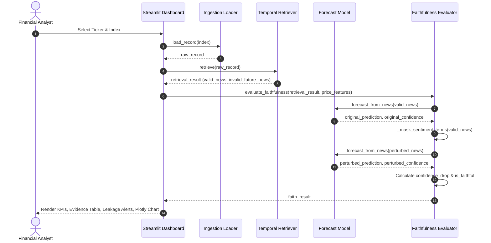

# System Design: Stock Forecasting & Faithfulness

This document details the system architecture and design decisions for the stock forecasting and faithfulness pipeline.

---

## 1. Context & Completed State

The project focuses on building an evidence-centric forecasting prototype.
*   **Week 1 & 2 (Completed)**: Raw data loading, schema adapter, temporal retriever, sentiment evidence extractor, and rule-based forecast model.
*   **Week 3 (Completed & Verified)**:
    *   `src/faithfulness_metrics.py` implements Temporal Validity, Evidence Support, and counterfactual Confidence Drop metrics.
    *   `src/dashboard.py` provides an interactive Streamlit UI dashboard with ticker filtering, selection, KPI columns, lookup banners, and Plotly visualization.
    *   `src/main.py` is updated to run the pipeline end-to-end and outputs files.
    *   **Test Suite**: 36 tests passing (adding smoke tests for the dashboard module). All tests pass successfully.

---

## 2. Goals / Non-Goals

### Goals
- [x] Calculate three faithfulness metrics: Temporal Validity, Evidence Support, and Confidence Drop.
- [x] Build a Streamlit dashboard displaying prediction summaries, evidence tables, lookahead alerts, and confidence drop graphs.
- [x] Maintain strict temporal retriever firewalls to reject lookahead data.
- [x] Ensure all logic is covered by unit and smoke tests.

### Non-Goals
- Production database integration or real-time scraping.
- Fine-tuning advanced deep learning models (scheduled for Week 4 GPU sprint).

---

## 3. System Architecture & Data Flow

The architecture flows sequentially from raw data ingestion to dashboard visualization. Below is the interactive sequence of operations:



---

## 4. Detailed Component Design (Week 3)

### Faithfulness Evaluator (`src/faithfulness_metrics.py`)
Provides core utility functions:
*   `calculate_temporal_validity(valid_count, invalid_count) -> float`
*   `calculate_evidence_support(evidence, prediction) -> float`
*   `calculate_confidence_drop(valid_news, price_features) -> dict`
    *   *Perturbation strategy*: Create a copy of the valid news array, swap out identified positive/negative keywords with neutral placeholder `"note"`, run the forecast model on this perturbed set, and measure the difference in confidence.
*   `evaluate_faithfulness(retrieval_result, price_features) -> dict` (single entry-point).

### Interactive Dashboard (`src/dashboard.py`)
A Streamlit application structured as follows:
*   **Modular Entry (`main()`)**: Wrapped in a function to allow side-effect-free import testing under Pytest.
*   **Sidebar**: Selection of tickers (AAPL, TSLA, NVDA) and specific forecast record indices.
*   **Main Panel**:
    *   *Metric Columns*: Visual KPIs showing forecast direction, confidence score, and faithfulness metrics.
    *   *Alert Banner*: Renders alerts if any `invalid_future_news` is caught by the Temporal Retriever.
    *   *Evidence Table*: Shows titles, extracted polarities, and support scores.
    *   *Visualization Section*: A Plotly bar chart comparing original confidence vs. perturbed confidence (representing necessity of evidence).
    *   *Warnings Logs*: Logs of schema anomalies (e.g., missing fields).

---

## 5. Canonical Data Models

### System Output Schema (combined prediction + faithfulness)
```json
{
  "ticker": "TSLA",
  "forecast_time": "2026-06-03 09:00:00",
  "prediction": "DOWN",
  "confidence": 0.81,
  "evidence": [
    {
      "news_id": "N-TSLA-001",
      "title": "Tesla recalls vehicles due to autopilot defect",
      "direction": "DOWN",
      "score": 0.79,
      "evidence_terms": {
        "positive": [],
        "negative": ["recall", "defect"]
      },
      "rationale": "negative terms"
    }
  ],
  "warnings": [
    "Record 2: news item N-TSLA-002 filtered due to future timestamp."
  ],
  "faithfulness": {
    "temporal_validity": 0.50,
    "evidence_support": 1.00,
    "confidence_drop": 0.26,
    "is_faithful": true
  }
}
```

---

## 6. Testing & Execution Verification

- **Unit Tests**:
  - `tests/test_week3_metrics.py` covers all three metrics, keyword masking, and full pipeline integration.
  - `tests/test_week3_dashboard.py` provides an import smoke test verifying layout structure is importable.
  - Total: 36 test cases passing successfully.
- **Pipeline Runner**:
  - `python src/main.py` processes 38 dataset records without error, writing outputs to `outputs/week3_pipeline_output.json` and `outputs/faithfulness_results.csv`.
- **Defensive Error Handling**:
  - Wrapped price-feature casting inside `src/forecast_model.py` with `try/except` to elegantly handle invalid/malformed float values (such as `"x"` in the sample dataset for MSFT) and generate validation warnings without crashing.

---

## 7. Open Spec Repository Structure

```
update-week-three-specs/
├── data/
│   └── sample_dataset.json             <- Sample stock/news data
├── src/
│   ├── loader.py                       <- Ingestion
│   ├── schema_adapter.py               <- Normalization
│   ├── retriever.py                    <- Temporal filter
│   ├── evidence_extractor.py           <- Lexicon extractor
│   ├── forecast_model.py               <- Rule-based forecaster
│   ├── faithfulness_metrics.py         <- Faithfulness metrics & perturbation
│   ├── dashboard.py                    <- Streamlit dashboard app
│   └── main.py                         <- Entry point
├── tests/
│   ├── test_week1_pipeline.py          <- Retriever tests
│   ├── test_week2_extraction.py        <- Lexicon extraction tests
│   ├── test_week2_forecast.py          <- Forecasting tests
│   ├── test_week3_metrics.py           <- Faithfulness metric tests
│   └── test_week3_dashboard.py         <- Dashboard smoke test
└── openspec/
    └── faithful-evidence-forecasting/
        ├── proposal.md
        ├── design.md
        └── specs/
            └── forecasting/
                └── spec.md
```
