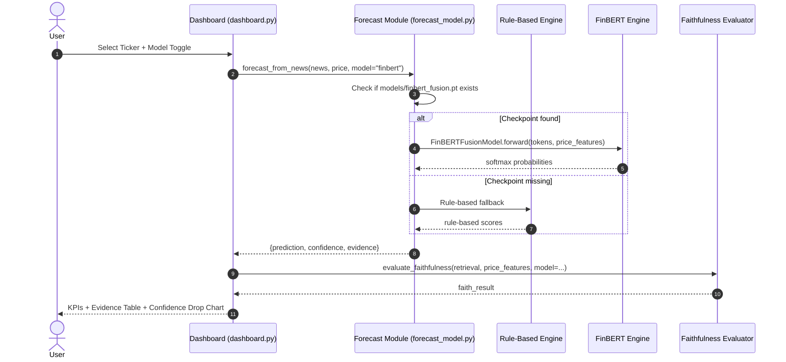

# Design: FinBERT Fusion Model — Week 4

## Context

The project currently uses a fully deterministic, rule-based forecasting engine (`src/forecast_model.py`) that combines lexicon sentiment scores with 5-day price returns to predict UP/DOWN/HOLD. While this satisfies Weeks 1–3 requirements and passes all 36 tests, it cannot model linguistic nuance (negation, sarcasm, domain jargon). Week 4 introduces a **FinBERT Fusion Classifier** trained on Google Colab (T4 GPU) and integrated as an optional model backend — keeping the existing rule-based path fully intact.

Key constraints:
- Output schema **must not change**: downstream faithfulness evaluator and dashboard consume `{prediction, confidence, evidence}` identically regardless of model backend.
- No breaking changes to any tested interface.
- The checkpoint (`models/finbert_fusion.pt`) may be absent in local environments where GPU training was not run; the system must fall back gracefully to the rule-based model.
- Academic deadline: Week 4 sprint ends **June 30, 2026**.

---

## Goals / Non-Goals

**Goals:**
- Train a `FinBertFusionClassifier` (FinBERT CLS embedding + price features → UP/DOWN/HOLD) on Colab T4.
- Export the trained checkpoint and integrate it into `src/forecast_model.py` as a second inference path.
- Add a runtime model-selection mechanism (env var + dashboard toggle) with graceful fallback.
- Extend the Streamlit dashboard with a side-by-side model comparison panel.
- Provide unit tests that verify schema compatibility and graceful fallback.
- Produce `outputs/week4_comparison.csv` comparing rule-based vs FinBERT predictions across the full corpus.

**Non-Goals:**
- Real-time inference or serving (no API server).
- Hyperparameter search / AutoML.
- Replacing the rule-based model — it remains the default when the checkpoint is absent.
- Re-implementing the faithfulness evaluator for FinBERT (same functions are reused).

---

## Decisions

### D1: Frozen FinBERT backbone during fine-tuning

**Decision:** Freeze all FinBERT (`ProsusAI/finbert`) parameters during training; only train the fusion and output layers.

**Rationale:** Our corpus is small (~300 records). Fine-tuning all 110M BERT parameters would overfit. A frozen backbone acts as a fixed feature extractor and trains in minutes on T4.

**Alternatives considered:**
- Full fine-tuning: Risk of catastrophic forgetting + overfitting on small corpus.
- Adapter layers (LoRA): Overkill for a student prototype; adds dependency complexity.

---

### D2: Output schema backward-compatibility

**Decision:** `forecast_from_news_finbert()` returns the same dict structure as `forecast_from_news()`:
```python
{
  "prediction": "UP" | "DOWN" | "HOLD",
  "confidence": float,          # max softmax probability
  "evidence_count": int,
  "evidence": list[dict]        # evidence passed through from rule-based extractor
}
```

**Rationale:** The faithfulness evaluator calls the forecast function by interface, not by name. By keeping identical outputs, zero changes are needed to `faithfulness_metrics.py`, `dashboard.py`, or `main.py`.

**Note:** Evidence terms are still extracted using the existing lexicon extractor — FinBERT only changes the *confidence/direction*; the evidence attribution layer remains rule-based and explainable.

---

### D3: Model selection via environment variable + function parameter

**Decision:** `USE_FINBERT=1` environment variable enables FinBERT globally. Individual callers can also pass `model="finbert"` / `model="rule"` explicitly.

**Rationale:** Simple, no config file needed. Dashboard sidebar toggle sets `model=` at call time. `main.py --model finbert` sets the env var for batch runs.

---

### D4: Graceful fallback when checkpoint is absent

**Decision:** If `models/finbert_fusion.pt` does not exist, log a warning and transparently fall back to the rule-based model. No exception is raised.

**Rationale:** Team members who haven't run the Colab notebook can still use the dashboard and run all tests without a GPU.

---

## System Architecture



---

## Colab Training Pipeline

The Colab notebook (`notebooks/week4_finbert_training.ipynb`) follows this sequence:

1. **Data loading**: Read `data/financial_corpus.csv`, split 80/20 train/val.
2. **Tokenization**: `AutoTokenizer.from_pretrained("ProsusAI/finbert")` with `max_length=128`.
3. **Dataset class**: `FinBERTDataset` wraps tokenized headlines + price feature tensors.
4. **Model**: `FinBertFusionClassifier` — frozen BERT backbone, linear fusion layer (`768 + 2 → 128`), output layer (`128 → 3`).
5. **Training**: Adam optimizer, `lr=2e-4`, 5 epochs, CrossEntropyLoss, batch size 16.
6. **Export**: `torch.save(model.state_dict(), "finbert_fusion.pt")` + `pickle.dump(label_encoder, ...)`.
7. **Evaluation**: Print accuracy, confusion matrix, and avg confidence drop vs rule-based baseline.

---

## Risks / Trade-offs

| Risk | Mitigation |
|---|---|
| Corpus too small for meaningful FinBERT gains | Acceptable for academic prototype; comparison table shows both models honestly |
| Colab session timeout during training | Save checkpoint at each epoch; resume from latest |
| `models/` directory not in git (large file) | Add `models/*.pt` to `.gitignore`; document manual download in README |
| FinBERT evidence attribution is opaque | Evidence terms still come from the rule-based lexicon extractor; attribution chain remains explainable |
| Local environment lacks `torch`/`transformers` | Graceful fallback + clear `requirements-gpu.txt` instructions |

---

## Migration Plan

1. Add `models/` directory with `.gitkeep` (checkpoint excluded from git).
2. Add `torch`, `transformers`, `scikit-learn` to `requirements-gpu.txt` (separate from main `requirements.txt` to avoid breaking local envs).
3. Deploy Colab notebook; download checkpoint to `models/finbert_fusion.pt`.
4. Set `USE_FINBERT=1` in `.env` or dashboard toggle to activate.
5. Run `python src/main.py --model finbert` for batch comparison.
6. Rollback: unset `USE_FINBERT`; rule-based model is always available.

---

## Open Questions

- **Q1:** Should model weights be uploaded to Google Drive and linked in README for reproducibility? *(Recommendation: Yes, with a download script.)*
- **Q2:** Should the confusion matrix and accuracy tables be rendered inside the Streamlit dashboard or only in the Colab notebook? *(Recommendation: Dashboard shows a simple accuracy comparison card; detailed matrix stays in Colab.)*
