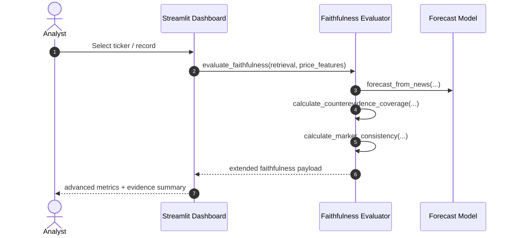

# Design: Week 5 Advanced Faithfulness Expansion

## Status

Implemented and verified in the local repository as of 2026-07-04.

## Context

The repository already implements a complete Week 1–4 pipeline for temporal retrieval, evidence extraction, rule-based forecasting, FinBERT fallback support, faithfulness evaluation, dashboard visualization, and CLI batch execution. Week 5 focuses on extending the faithfulness layer so the project better reflects the advanced rubric goals while keeping the existing architecture intact.

The design follows these principles:

- Preserve backward compatibility with current module entry points.
- Keep all new metrics deterministic and explainable.
- Make the results user-visible in both the Streamlit dashboard and the CLI outputs.
- Avoid introducing heavy dependencies or large runtime changes.

## Goals / Non-Goals

### Goals

- Add a counterevidence coverage metric that quantifies whether a forecast includes both supporting and opposing evidence.
- Add a market consistency metric that links evidence polarity to a simple market regime derived from price and volume features.
- Surface the new metrics in the dashboard and in batch outputs.
- Add regression tests for the new metrics and ensure the existing test suite remains green.

### Non-Goals

- Replacing the rule-based or FinBERT backends.
- Introducing a full MLOps or production monitoring stack.
- Adding new model training or external data sources.

## Proposed Architecture



## Design Decisions

### D1: Keep the existing forecast interface unchanged

The existing forecast functions return the same schema used in earlier weeks. The new metrics are computed as additional derived values in the faithfulness evaluation layer rather than by changing the forecast contract.

### D2: Use rule-based evidence for advanced diagnostics

Counterevidence and market consistency are derived from the existing evidence list and price features rather than from the model internals. This keeps the analysis transparent and aligned with the explainability objective of the project.

### D3: Make metrics optional but always present

The evaluation function will always return the advanced metrics with safe defaults. This makes dashboard rendering and batch outputs simple and prevents downstream type errors.

### D4: Keep the dashboard lightweight

The dashboard will show a compact metrics section rather than a full analytics page. It will remain easy to run locally and compatible with the current Streamlit setup.

## Component Design

### Faithfulness Evaluator

The evaluator will expose two new functions:

- calculate_counterevidence_coverage(evidence, prediction) -> float
- calculate_market_consistency(evidence, price_features) -> dict

And it will extend evaluate_faithfulness(...) to return:

- counterevidence_coverage
- market_consistency
- market_regime

### Dashboard

The dashboard will add a compact panel that displays:

- counterevidence coverage,
- market regime,
- market consistency score,
- a short explanation of how the evidence aligns with the market context.

### CLI / Batch Outputs

The batch main pipeline will continue writing the existing JSON and CSV outputs, while extending them with the additional faithfulness fields for downstream inspection.

## Data Model Extensions

The faithfulness block will now include:

```json
{
  "counterevidence_coverage": 1.0,
  "market_regime": "bull",
  "market_consistency": 1.0
}
```

## Testing Strategy

- Unit tests will cover the new metric functions directly.
- Integration tests will ensure the extended evaluate_faithfulness payload includes the new fields.
- The existing full test suite remains the regression gate.
